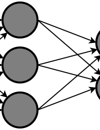

<!-- PROJECT LOGO -->
<br />
<p align="center">
  <a href="https://github.com/SaoodCS/Backpropagation-Algorithm">
    
  </a>

  <h3 align="center">Error-Correcting MLP Backpropagation Algorithm</h3>

  <p align="center">
    This is a project I did as part of my Computer Science degree. It involves designing a MLP backpropagation algorithm, which taking a dataset of 8 predictors and 1 predictant, splitting the dataset and evaluating its performance in predicting the predicant on the test sub-dataset.
  </p>
</p>


<!-- TABLE OF CONTENTS -->
<details open="open">
  <summary>Table of Contents</summary>
  <ol>
    <li>
      <a href="#about-the-project">About The Project</a>
      <ul>
        <li><a href="#built-with">Built With</a></li>
        <li><a href="#plugins-and-packages">Plugins and Packages</a></li> 
      </ul>
    </li>
    <li>
      <a href="#getting-started">Getting Started</a>
      <ul>
        <li><a href="#prerequisites">Prerequisites</a></li>
        <li><a href="#installation">Installation</a></li>
      </ul>
    </li>
    <li><a href="#user-guide">User Guide</a></li>
    <li><a href="#contributing">Contributing</a></li>
    <li><a href="#license">License</a></li>
    <li><a href="#contact">Contact</a></li>
  </ol>
</details>


<!-- ABOUT THE PROJECT -->
## About The Project

The purpose of this project was implement an artificial neural network, more specifically and multi layered perceptron, trained using the error backpropagation algorithm. The process included data pre-processing (splitting the data into training, validation and test subsets and standardising the data) and creating, training, and implementing the neural network to predict index floods from the given data set.


### Built With

This section lists all major frameworks, programming languages, packages and libraries used throughout the project.
* [Pyhton 3.9.7](https://www.python.org/downloads/release/python-397/)
* [Jupyer](https://jupyter.org/)
* [Numpy](https://numpy.org/doc/stable/)
* [Pandas](https://pandas.pydata.org/)
* [Math](https://docs.python.org/3/library/math.html)
* [Matplotlib](https://matplotlib.org/)

<!-- GETTING STARTED -->
## Getting Started

To set up this project, get a local copy up and running by either cloning this repository to your IDE,
or downloading the ZIP file of the repository and opening it in your IDE.


### Prerequisites

You will need to install the following software in order to run this project.
* [Pyhton 3.9.7](https://www.python.org/downloads/release/python-397/)
* [Jupyer](https://jupyter.org/)
* [Numpy](https://numpy.org/doc/stable/)
* [Pandas](https://pandas.pydata.org/)
* [Math](https://docs.python.org/3/library/math.html)
* [Matplotlib](https://matplotlib.org/)

### Installation
1. Download the latest version of Python. The download link and installation guide can be
found on the following link: [https://www.python.org/downloads/](https://www.python.org/downloads/)
2. Download Jupyter Notebook for an enhanced experience when running the project (optional): [https://jupyter.org/](https://jupyter.org/)
3. Download all the python libraries listed above in the prerequisites section:<a href="#prerequisites">Prerequisites</a>
3. Clone the repository to your IDE through the command line using the "git" function or through your IDE. Copy the following repository URL:
   ```sh
   https://github.com/SaoodCS/Backpropagation-Algorithm
   ```
4. Run the python file "Backprop Alg with Bold Driver" in your IDE. 


<!-- USAGE EXAMPLES -->
## User Guide
1. Run the python file "Backprop Alg with Bold Driver" in your IDE. 
2. Enter 8 as the number of inputs, 1 as the number of outputs (as this is the predictors and predictant of this specific dataset in dataset.txt.)NOTE: You can run the algorithm on your own dataset too by formatting it into a txt file and saving it to the same folder
as the algorithm (the first x columns on the LHS should be the inputs and the last x columns on the RHS shoulf be the outputs).
3. Enter any number between 4 and 14 as the number of nodes in the hidden layer. 


<!-- CONTRIBUTING -->
## Contributing
As of now, this project isn't open to contributions. The only contributer is myself, though this may change in the future.


<!-- LICENSE -->
## License

Distributed under the MIT License.


<!-- CONTACT -->
## Contact

Saood - saood-aslam@outlook.com

Project Link: [https://github.com/SaoodCS/Ingredilist](https://github.com/SaoodCS/Ingredilist)